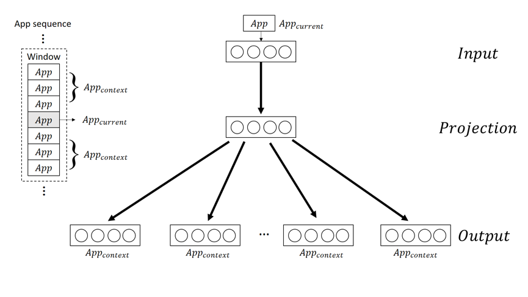

# App2Vec_Python
This interface allows you to easily build the App2Vec model and other related advanced models(including ANN, Affinity Propagation).

## App2Vec
App2Vec is an unsupervised learning method to embed words into a dense vector space. In this dense vector space, semantically and syntactically related words are close to each other. App2Vec uses a shallow neural network that is trained to learn the distribution representation of words. In basic, Word2Vec is a single layer neural network with one hidden layer. Both input and output are represented as the One-Hot encoding. The learned vector of words is stored as input-hidden layer weight matrix.

There are two modes of Word2Vec model: (1) Continuous Bags of Word (CBOW) and (2) Continuous Skip-Gram. 
### CBOW
CBOW model is given the context words to predict the center word in the window. In order to represent the vector of context words, CBOW averages or sums the vector of each context word. Given context words of the current words, the objective of CBOW is to maximize the log probability of current word.

### Continuous Skip-Gram
Contrary to CBOW, Continuous Skip Gram model is given the current word to predict various individual context words in the window. Given the current word, the goal of Continuous Skip-Gram model is to maximize the log probability of context words.

The figure of Continuous Skip-Gram mode is shown as below.


In this interface, we use gensim library to achieve it.
(View more,https://radimrehurek.com/gensim/models/word2vec.html)

## Training Data
App2Vec treats each app as a unit. And we use daily app usage data as our training data.
Of course, it's impossible to train the raw data directly.
So we provide the below function：

### Function parameter
Function: `App2Vec.csv2training_data`

Goal: Prepeare the training data of App2Vec.

`raw_file_path` = The storage location of your raw training data (Currently, we only support the csv file).

`app2vec_model_path` = The storage location of App2Vec model.

Raw data should be like...
Each row has a app sequence which contains several apps.

| app sequence1 |
| :--- |
| app sequence2 |
| app sequence3 |
| app sequence4 |
| app sequence5 |
| app sequence6 |
| ... |


### Usage
```text
import app2vec.App2Vec

#-------------------------------------------------------------------------------------------------------
# Prepare the training data of app2vec.
app2vec = App2Vec()
app2vec.csv2training_data(raw_file_path = '/Users/apple/Documents/raw_data.csv')
app2vec.training_App2Vec(model_path = '/Users/apple/Documents/app2vec.model')
```
In this case, we can get the app2vec which name is app2vec.model.

# ANN
The objective of the nearest neighbor search is to find objects similar to the query point from a collection of objects. However, the processing cost is very high when the nearest neighbor search is applied to a high-dimensional data. For this reason, Approximate Nearest Neighbor(ANN) search is proposed to tackle this problem. ANN reduces the cost of processing greatly by sacrificing a little accuracy but get similar results to nearest neighbor search. ANN can be roughly categorized into two groups: Data Structure-based, Hash-based.

In this interface, we use AnnoyIndex library to achieve it. AnnoyIndex is a hash-based ANN.
(View more, https://github.com/spotify/annoy)

### Function: `App2Vec.training_App2Vec`

Goal: Train the App2Vec model.

`app2vec_model_path` = The storage path of App2Vec model.

### Function: `App2Vec.ANN`

Goal: Train the ANN model.

`dim` = the Dimension of App2Vec.

`num_tree` = The number of trees of your ANN forest. More tress more accurate.

`ann_model_path` = The storage path of ANN model.

### Usage
```text
import app2vec.App2Vec

#-------------------------------------------------------------------------------------------------------
# Prepare the training data of app2vec.
app2vec = App2Vec()
app2vec.csv2training_data(raw_file_path = '/Users/apple/Documents/raw_data.csv')

#-------------------------------------------------------------------------------------------------------
# Train the App2Vec model
app2vec.training_App2Vec(app2vec_model_path = '/Users/apple/Documents/app2vec.model')

#-------------------------------------------------------------------------------------------------------
# Train the ANN model
app2vec.ANN(dim = 64,num_tree = 10000,app2vec_model_path = '/Users/apple/Documents/app2vec.model',ann_model_path = '/Users/apple/Documents/ANN.model')
```

# Affinity Propagation
Affinity Propagation is a unsupervised learning method which does not require the pre-defined number of clusters. It can automatically find a collection of objects which are representative of clusters and discover the number of clusters.

In order to find the exemplars for each cluster, Affinity Propagation takes a set of pairwise similarities as input and passes the messages between these pairwise data objects. In this training stage, Affinity Propagation updates two matrices  and .  represent the responsibility of each object. A higher value for the  of object in cluster  means that object would be a better exemplar for cluster .  represent the availability of each object. A higher value for the  of object in cluster  means that object would be likely to belong to cluster . This updating is executed iteratively until convergence. Once convergence is achieved, exemplars of each cluster are generated. Affinity Propagation outputs the final clusters.

In this interface, we use Scikit-learn library to achieve it.
(View more, https://radimrehurek.com/gensim/models/word2vec.html)

### Function: `affinity_propagation`

Goal: Train the Affinity Propagation model.

`app2vec_model_path` = The storage path of App2Vec model.
`af_model_path` = The storage path of Affinity Propagation model.
`prefer` = The preference of Affinity Propagation model.

### Function: `get_label2id`

Goal: Build the mapping of AF labels and app sequences.

`af_model_path` = The storage path of Affinity Propagation model.

### Usage
```text
import app2vec.App2Vec

#-------------------------------------------------------------------------------------------------------
# Train the App2Vec model
app2vec = App2Vec()
app2vec.csv2training_data(raw_file_path = '/Users/apple/Documents/raw_data.csv')

#-------------------------------------------------------------------------------------------------------
# Train the App2Vec model
app2vec.training_App2Vec(app2vec_model_path = '/Users/apple/Documents/app2vec.model')

#-------------------------------------------------------------------------------------------------------
# Train the AF model
app2vec.affinity_propagation(app2vec_model_path = '/Users/apple/Documents/app2vec.model',af_model_path = '/Users/apple/Documents//NewAFCluster.pkl',prefer = -30)

#-------------------------------------------------------------------------------------------------------
# get the mapping with cluster labels and app sequences. (store in a attritube which name is label2id)
app2vec.get_label2id(af_model_path = '/Users/apple/Documents//NewAFCluster.pkl')
```


